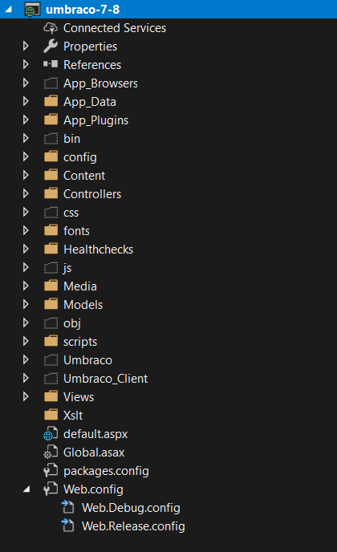
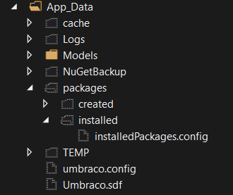

# Source Control

## Umbraco Cloud

If you are running your site on Umbraco Cloud - and why wouldn't you be? - then source control is very much part of the experience, have a look at the ['Technical overview of an Umbraco Cloud Environment'](https://our.umbraco.org/documentation/Umbraco-Cloud/Getting-Started/Environments/)  and the information on ['Working with your Umbraco Cloud project'](https://our.umbraco.org/documentation/Umbraco-Cloud/Set-Up/#working-with-your-umbraco-cloud-project) for a steer on Source Control.

## Outside of Umbraco Cloud

If you are running Umbraco outside of the Umbraco Cloud and decide to source control your Umbraco implementation work, and you should! - then a frequently asked question is:

### What folders and files should I exclude from my source control repository?

A little depends on whether you are working with a team of developers, how you have installed Umbraco, how your development environment is setup - also how you intend to build and deploy your solution to your target environment.

But this information should at least give you an indication of how a typical Umbraco site is structured, and therefore which bits need to be source controlled, and which bits shouldn't be...

#### The Umbraco Folders

These are the /umbraco and /umbraco_client folders inside your solution - these should not need to be source controlled - their contents change when you upgrade Umbraco, but no part of your implementation or third party packages installed should update these folders. (Historically that has not always been the case, and in the past icons and plugins have been added within these folders, and have needed to be added to source control) - if you are working with Visual Studio and a Build Server, it's Nuget's job to restore the correct versions of these folders for you and generally you wouldn't include these folders in your Visual Studio project, there is a build step, that ensures they are 'deployed' along with your solution when using Web Deploy.

#### App_Data Folders

When Umbraco is running it will generate some files on disk,  for caching purposes, site indexes, and the published cache file amongst others. Unless configured otherwise, these will generally be created in the App_Data folder of your application, and do not need to be source controlled.

They include:

 - cache - ImageProcessor ships with Umbraco and when an image is requested via the processor, eg to be resized or cropped, a cached version of the transformed image will be stored in this folder. (The Image Processor Config /config/imageprocessor/cache.config allows you to determine where this cache is stored)
 - Logs - Umbraco uses Log4Net, and a file will be generated in this folder containing tracelogs of your application, one file for each day. There is no need to source control logs!
 - NuGetBackup - If you've installed or upgraded Umbraco via NuGet, then a backup of files before they were replaced will be copied here. No need to source control these.
 - Temp - as the name suggests, temporary no need to source control.
   - ClientDependency, Umbraco uses the Client Dependency Framework, to minimise and munge resources into single requests for the backoffice - a cache is kept here.
   - ExamineIndexes, Umbraco uses Examine, to index content for searching within the backoffice, unless configured otherwise the indexes will be generated here.
   - PluginCache - a hash and list of the plugins installed in your implementation
 - umbraco.config - This is an XML file containing all published content on your site - no need to source control this, Umbraco will continually update this file, and a version held in memory when content is published and unpublished, so source controlling this file would play havoc with how Umbraco works!
 - Umbraco.sdf - If you are using SQLCE for the data store in your Umbraco site, then this file IS that datastore, it will be difficult to source control this file.

Note:
*    There is a file /app_data/pacakges/installed/installedPackages.config that lists all packages installed via the Umbraco backoffice, depending on how you update or install packages to your site, it can be useful to track changes to this file in source control_*

#### Modelsbuilder

The strategy here will depend a little on which mode Modelsbuilder is running in.
 - Pure Live, no source control allow Umbraco to generate
 - App_Data, you can source control, and these will be built into your application dll
 - Dll, if your working with a team, then this can be problematic managing conflicts, so remember to 'regenerate' your dll, after pulling from source control._
 - API, generate the models into a seperate extension project and source control them.

#### Media

The Media section of Umbraco (unless configured otherwise) stores files in the /media folder, these can be updated by editors, in the Umbraco backoffice, so generally speaking you would not source control these files.

#### Packages installed via Nuget

The App_Plugins folder is the home for all third party packages installed on your site, if they are installed via NuGet then as long as the packages.config file in the route of your project is source controlled, then individual plugins shouldn't need to be source controlled - however each plugin could be different, and so may contain files it would be useful to track via Source control.

### What folders and files should I Include in my source control repository?

#### Front end build

A lot depends on how you are running your front end build, eg you may be generating your css / js from SASS or CoffeeScript, and it is the source of your frontend implementation that would need to be source controlled, allowing the actual css/js files to be generated during the build process, but generally speaking it's your Javascript, Css and Page Furniture eg /img and fonts - anything your site implementation uses statically

#### Views/Templates/Partials

Umbraco site templates/views can be edited via the Umbraco Backoffice, but ultimately they reside in the views folder on disk, and should be source controlled.

#### Controllers/Classes

Any C# implementation, eg Surface Controllers, ViewModels etc, supporting projects, App_Code, Models generated by Modelsbuilder in API or App_Data mode - should be source controlled.

#### Packages installed via the Backoffice

The App_Plugins folder is the home for all third party packages installed on your site, if they are not installed via NuGet then they should be added to source control.

#### Config

Your site's /config folder contains the set of configuration files for your Umbraco site.

#### DocumentType - Backoffice Structure Changes

When you create and edit DocumentTypes, MediaTypes, DataTypes, Macros, DictionaryItems, Languages, MemberTypes & Templates('names' not the actual files) in the Umbraco Backoffice these values are stored in the Umbraco Database, making them difficult to source control. However there is a third party package called uSync - https://our.umbraco.org/projects/developer-tools/usync/ which when installed will serialize these settings to disk, in a folder called /uSync - enabling you to source control these changes too.

## Example gitignore

github has a repository of gitignore files which are a great starting point for working with Umbraco and source control.

Combining: [VisualStudio.gitignore](https://github.com/github/gitignore/blob/master/VisualStudio.gitignore) & [Umbraco.gitignore](https://github.com/github/gitignore/blob/master/Umbraco.gitignore)
